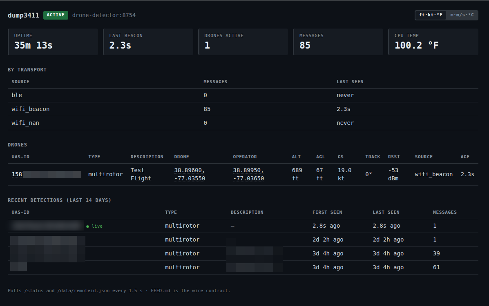
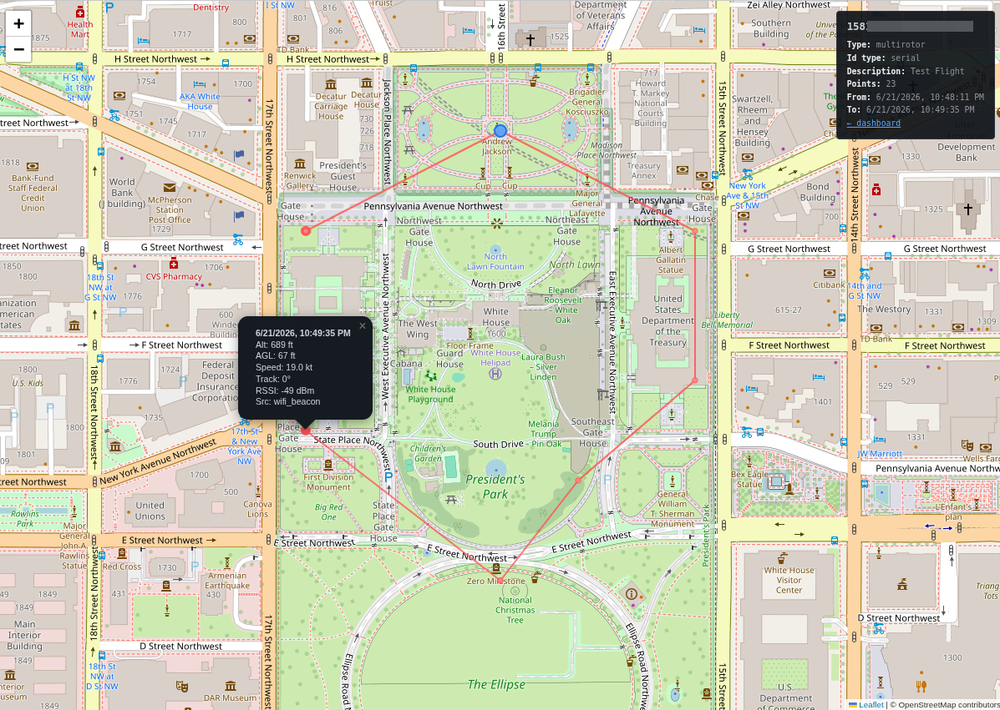

# dump3411

A local-only Remote ID detector for Linux. Picks up the mandatory drone identification broadcasts on BLE and Wi-Fi Beacon, decodes them per ASTM F3411, prints them to the system journal, and serves a status dashboard plus a JSON feed on the LAN. Nothing leaves the host.

Spiritual sibling of [dump1090](https://github.com/flightaware/dump1090) (ADS-B at 1090 MHz) and dump978 (UAT at 978 MHz). The `3411` is the ASTM standard number — Remote ID isn't tied to a single frequency the way ADS-B or UAT are, so a spec number is the more honest identifier.

## Quickstart

You'll need a Linux host with Python 3.10+, a Bluetooth adapter (built-in or USB), and a USB Wi-Fi adapter that supports monitor mode (Alfa AWUS036NEH or any Ralink RT3070-based adapter).

```bash
git clone https://github.com/ifnull/dump3411.git
cd dump3411
sudo ./install.sh
```

`install.sh` installs apt dependencies, auto-detects your USB Wi-Fi adapter (prompts if multiple are present), rewrites the systemd unit's `ExecStart` paths to match this checkout, then enables + starts the service. It's idempotent — re-run after a `git pull` to roll out config changes.

Open the dashboard from any LAN host:

```bash
echo "http://$(hostname -I | awk '{print $1}'):8754/"
```

If you'd rather do it by hand, the manual install is:

```bash
sudo apt install -y python3-bleak iw rfkill bluez
# edit ExecStart in dump3411.service for your interface and repo path
sudo cp dump3411.service /etc/systemd/system/
sudo systemctl daemon-reload
sudo systemctl enable --now dump3411
```

Service status / live tail:

```bash
sudo systemctl status dump3411
journalctl -u dump3411 -f
```

By default the journal is volatile — wiped on reboot. To make detection history persist (capped at 50 MB so it can never fill the disk):

```bash
sudo mkdir -p /etc/systemd/journald.conf.d
sudo cp journald-dump3411.conf /etc/systemd/journald.conf.d/
sudo systemctl restart systemd-journald
```

## What you'll see

When a Remote-ID-compliant drone broadcasts in range, the journal logs each decoded message. All three ASTM F3411 transports are decoded — BLE, Wi-Fi Beacon, and Wi-Fi NAN:

```
[BLE]          MAC=...  RSSI=-62dBm  Type=Basic ID         UAS-ID=1581F...
[WiFi-Beacon]  MAC=...  RSSI=-71dBm  Type=Location/Vector  lat=40.7128 lon=-74.0060
[WiFi-NAN]     MAC=...  RSSI=-68dBm  Type=Basic ID         UAS-ID=...
```

The dashboard at `http://<host>:8754/` shows a live status pill, per-transport message counters, CPU temperature, and a table of currently tracked drones with clickable Google Maps links for both the drone position and the operator location. A header toggle switches the display between imperial (`ft·kt·°F`) and metric (`m·m/s·°C`); the wire feed stays imperial regardless.

If nothing's in range, the dashboard sits at IDLE and the journal stays quiet. That's expected — Remote ID is only broadcast by drones registered after September 2023, so coverage is sparse. See **[TESTING.md](./TESTING.md)** for how to put a transmitter on the air and confirm the whole path works.

## Screenshots

Dashboard with a single live drone — live drones table on top, Recent detections (last N days, configurable) below, both with clickable UAS-IDs that open the map view when history is enabled.



Map view at `/map?uas_id=…` — operator location pinned, drone polyline traced from history, each point clickable for the per-message detail (timestamp, altitude, speed, RSSI, transport).



## Hardware

Confirmed on a Raspberry Pi Zero W with an Alfa AWUS036NEH adapter. Should work on **any Linux host** that has:

- **A Bluetooth adapter** for BLE Remote ID. Built-in is fine.
- **A USB Wi-Fi adapter that supports monitor mode** for Wi-Fi Beacon Remote ID. The Alfa AWUS036NEH (RT3070) is what we tested. Most built-in Wi-Fi cards can't reliably enter monitor mode, so a dedicated USB adapter is the easy path.

On low-powered single-board hosts a powered USB hub is strongly recommended — the Wi-Fi adapter's current draw can brown out the SBC otherwise.

## Software

- Linux with **systemd** (the included `dump3411.service` requires it; `run-offline.sh` works without).
- **Python 3.10+** (uses PEP 604 `int | None` syntax).
- Tested on Raspberry Pi OS Bookworm; any modern systemd distro with Python 3.10+ should work too (Debian 12, Ubuntu 22.04+, Fedora, …).
- Architecture-agnostic — runs on ARMv6, ARMv7, AArch64, and x86_64.

## Configuration

The default `dump3411.service` assumes:

- Repository at `/home/pi/dump3411`
- USB Wi-Fi adapter is `wlan1`
- Feed listens on `0.0.0.0:8754`

Edit any of those in the service file before installing.

`dump3411.py --help` shows the full CLI:

```
--ble-adapter HCI    HCI adapter for BLE scan          (default: hci0)
--wifi-iface IFACE   monitor-mode interface             (default: wlan1)
--channel-dwell SEC  seconds per channel before hop     (default: 0.2)
--serve HOST:PORT    serve /data/remoteid.json + /      (omit for journal-only)
--ttl SECS           drop drones after N s of silence   (default: 60)
--verbose            log every decoded message type
```

## Status dashboard

`http://<host>:8754/` is a single self-contained HTML page (no CDN, no build step). It polls `/status` and `/data/remoteid.json` every 1.5 s and shows:

- Service health pill (ACTIVE / IDLE / OFFLINE)
- Top tiles: uptime, last-beacon age, drones active, total messages, CPU temp
- Per-transport message counters with last-seen timestamps
- Table of currently tracked drones — UAS-ID, type, **drone + operator coordinates as Google Maps links**, altitude, AGL, ground speed, track, RSSI, transport, age
- Unit toggle (per-browser, persists in `localStorage`)

## JSON feed

`GET http://<host>:8754/data/remoteid.json` returns the current tracker snapshot. The wire format is locked by **[FEED.md](./FEED.md)** — see that file if you're integrating a consumer (e.g. [`ha-airspace`](https://github.com/ifnull/ha-airspace), the Home Assistant airspace integration).

Quick check from any LAN host:

```bash
curl -s http://<host>:8754/data/remoteid.json | python3 -m json.tool
```

`GET /status` is also available — operational health (uptime, last beacon, CPU temp, per-source counters). Useful for Home Assistant binary sensors and uptime monitors.

## MQTT publisher

dump3411 can publish detections to an MQTT broker so consumers (Home Assistant automations, Node-RED, custom scripts) react without polling the JSON feed. Optional — only active when `--mqtt-broker` is configured.

Install the client lib:

```bash
sudo apt install -y python3-paho-mqtt
```

Configure via env vars (the service unit reads `/etc/dump3411.env` if it exists):

```bash
# /etc/dump3411.env
MQTT_BROKER=mqtt.lan:1883
MQTT_TOPIC_PREFIX=dump3411
MQTT_USER=dump3411
MQTT_PASSWORD=<your-password>
```

Then `sudo systemctl restart dump3411`. The same flags work on the CLI for manual runs: `--mqtt-broker`, `--mqtt-topic-prefix`, `--mqtt-user`, `--mqtt-password`.

Topic layout (under the configured prefix, default `dump3411`):

| Topic | QoS | Retained | Content |
|---|:--:|:--:|---|
| `<prefix>/online` | 1 | yes | `"online"` on connect; LWT publishes `"offline"` if dump3411 dies |
| `<prefix>/status` | 1 | yes | `GET /status` JSON, refreshed every ~5 s |
| `<prefix>/drones/<uas_id>` | 1 | yes | per-drone state (same shape as one row of `drones[]` in the JSON feed), latest-wins, debounced 1 Hz |
| `<prefix>/drones/<uas_id>` | 1 | yes | **empty payload** when a drone TTL-evicts — subscribers see the removal |
| `<prefix>/events/detection` | 0 | no | one publish per decoded message: `{uas_id, rid_source, rssi, t}` |

Units mirror FEED.md (imperial). The retained per-drone topic means a fresh HA restart immediately sees the current airspace. The `events/detection` stream is for automations that want to react on every beacon.

Quick LAN-side check after configuring:

```bash
mosquitto_sub -h mqtt.lan -t 'dump3411/#' -v
```

## Persistent detection history (optional)

When `--history-db PATH` is configured (or `HISTORY_DB=` in the env file), dump3411 logs every decoded snapshot to a SQLite database. Disabled by default — Pi SD cards are mortal.

```bash
# /etc/dump3411.env
HISTORY_DB=/var/lib/dump3411/history.db
HISTORY_MAX_MB=100           # default 100; rotates oldest rows when over
HISTORY_RETENTION_DAYS=30    # default 30; drops rows older than this
HISTORY_DEBOUNCE_S=1.0       # default 1.0; per-drone min write spacing
HISTORY_RECENT_DAYS=7        # default 7;   dashboard Recent table lookback
```

`sudo mkdir -p /var/lib/dump3411 && sudo chown root:root /var/lib/dump3411` before first start. Restart the service after editing the env file.

When history is enabled:

- Every UAS-ID in the dashboard becomes a clickable link to **`/map?uas_id=<ID>`** — a self-contained Leaflet page showing the operator location (blue marker) and the drone's full track (red polyline with per-point markers, click each for timestamp, altitude, AGL, speed, track, RSSI, transport).
- The dashboard gets a **Recent detections** table below the live Drones section, listing UAS-IDs seen in the configured window (default last 7 days; set `HISTORY_RECENT_DAYS=`) with type, description, first/last seen, message count, and a `● live` badge next to anything currently in the live tracker. Polled on a 30 s cadence — much slower than the 1.5 s live data. Same hyperlink behavior: click a UAS-ID to open its map.
- **`GET /history.json?uas_id=<ID>&since=<epoch>&until=<epoch>`** returns the same data as JSON for one drone. `since`/`until` are optional.
- **`GET /history/recent.json?since=<epoch>&limit=<N>`** lists recently-seen drones (defaults: configured `HISTORY_RECENT_DAYS` window — 7 days out of the box — and 50 most recent). Response includes `window_seconds` and `window_label` for clients that want to render the lookback.
- **`GET /status`** gains a `history_enabled: true` flag plus `history: { rows, drones, size_bytes, earliest_ts, latest_ts }`.

When history is **not** configured, `/map` and `/history.json` return 404 and the dashboard renders UAS-IDs as plain text — no UI surprises.

The map view loads Leaflet from a CDN and OSM tiles from OpenStreetMap (so this *one* page requires internet to render at all — tiles do); the rest of dump3411 stays fully offline.

## Logs

The detector writes no log file of its own; under systemd its output goes to the journal:

```bash
journalctl -u dump3411 -f                            # live tail
journalctl -u dump3411 --since "today"               # by date
journalctl -u dump3411 --since "2026-06-01 09:00"    # from a time
```

Persistence is handled by the journald drop-in installed in the Quickstart.

## Standalone single-radio mode

The per-radio scripts run on their own — handy when debugging one radio in isolation:

```bash
sudo python3 ble_feeder.py  --adapter hci0 --verbose
sudo python3 wifi_feeder.py --iface wlan1  --verbose
```

These do not serve the feed and do not update the shared tracker; only `dump3411.py` does. Use them only for diagnosing one radio's capture path.

## Notes

- Run as root: raw sockets, monitor mode, and Bluetooth all require it.
- Remote ID is only broadcast by drones registered after Sept 2023. Seeing zero detections usually just means nothing compliant is in range.
- The Wi-Fi capture parses every 802.11 management frame in Python. On single-core ARMv6 hosts (Pi Zero W) that's heavy and may drop packets under busy 2.4 GHz — fine for detection, not lossless. More-powerful hosts will keep up easily.
- The CPU-temp tile reads `/sys/class/thermal/thermal_zone0/temp`; on hosts without that file the dashboard shows `–`.

## Changelog

Release notes live in [CHANGELOG.md](./CHANGELOG.md).

## Credit & license

Inspired by the [DroneAware Node feeders](https://droneaware.io/). If you are looking for a user friendly experience, take a look at that project. See [LICENSE](./LICENSE).
